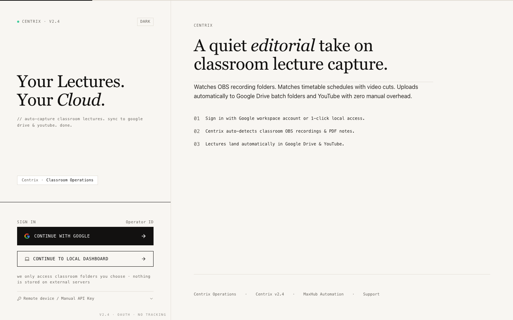
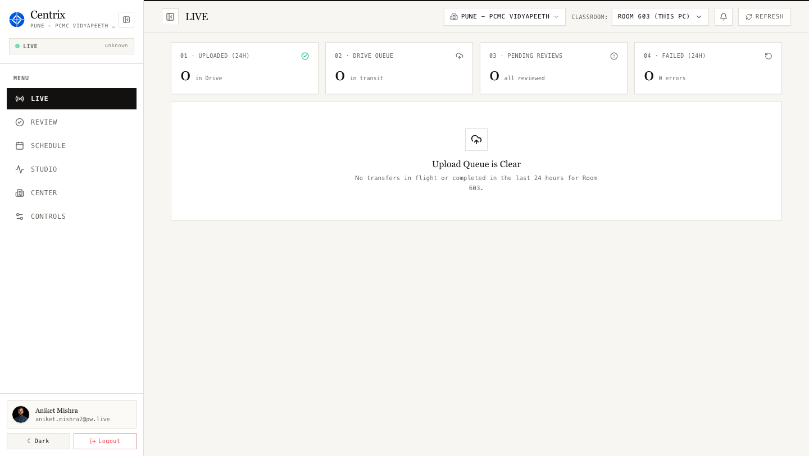
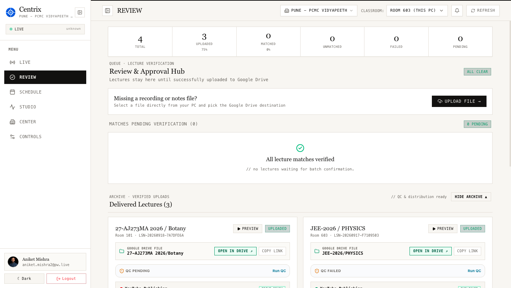
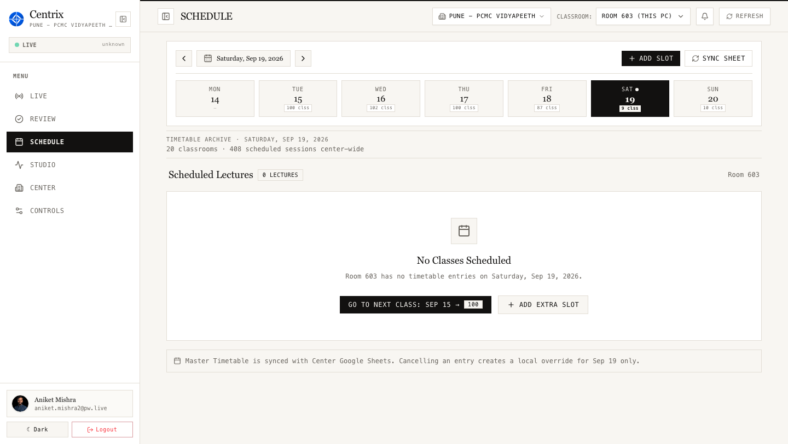
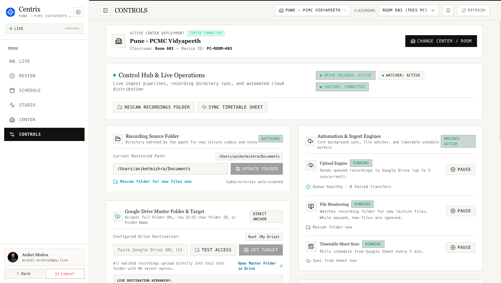

# CENTRIX
### Automated Classroom Lecture Capture, Smart Schedule Matching & Resilient Cloud Delivery

[-blue?style=for-the-badge&logo=windows&logoColor=white)](https://github.com/aniketmishra-0/Centrix_Demo)

 

<em>* Self-contained Windows installer (v1.0.4 • ~209 MB) — Zero external runtime dependencies.</em>

---

## 🎯 1. Executive Summary & Problem Statement

**Centrix** is an enterprise background automation and cloud synchronization service engineered specifically for offline classroom lecture recording operations across **PhysicsWallah Vidyapeeth & Pathshala Centers**.

### 🚨 The Operational Challenge in Offline Centers
Across offline center classrooms, faculties conduct dozens of scheduled lectures daily recorded via OBS Studio / cameras. In the traditional manual workflow, center operations staff must manually:
- Locate newly recorded raw MP4 files from local classroom workstation folders.
- Cross-reference daily master timetables to identify the exact Batch, Subject, and Faculty.
- Manually rename large video files according to naming standards.
- Navigate complex Google Drive folder structures and upload files manually.

> **Impact:** This manual workflow consumes **2 to 3 operational hours per center daily**, causes high bandwidth waste on interrupted uploads, and results in frequent human misclassifications (uploading lectures into incorrect batch folders).

### ⚡ The Centrix Solution (Zero-Touch Automation)
Centrix runs silently as a native background service on classroom workstations. **The moment an instructor concludes a lecture and recording stops, Centrix automatically:**
1. **Detects** the completed recording within milliseconds using real-time file system watchers.
2. **Correlates** classroom metadata against the center master schedule (Room, Time Window, Subject, Faculty).
3. **Calculates** algorithmic confidence scores ($\ge 85\%$ confidence triggers immediate zero-touch processing).
4. **Uploads** standardized recordings directly into mapped Google Drive batch directories and syncs with YouTube pipelines using byte-level resumable uploads.

---

## 🖥️ 2. Application Screenshots & Key Interfaces

Centrix provides an editorial-grade desktop and web dashboard designed for operators, center leads, and central academic administrators:

### Figure 1: Home Portal & Operator Access
*The clean editorial entrance portal with Google Workspace Single Sign-On (SSO) and 1-click local access for classroom workstations:*

  

 

### Figure 2: Live Classroom Ingest & Queue Monitor
*Real-time telemetry showing active center room monitoring (Room 603 - Pune PCMC Vidyapeeth), upload throughput, and 24-hour delivery status across the center:*

  

 

### Figure 3: Review & Approval Hub
*Verification queue where processed lectures are cataloged, verified, and linked directly to Google Drive batch destinations with QC status:*

  

 

### Figure 4: Master Schedule & Timetable Synchronization
*Automated timetable synchronization covering all center classrooms (e.g. 20 classrooms, 408 scheduled weekly sessions) directly synced with Google Sheets:*

  

 

### Figure 5: Operations Hub & Background Engine Controls
*Operational control center for managing real-time file watchers, resumable Google Drive upload concurrency, and automated YouTube distribution:*

  

---

## ⚙️ 3. Technology Architecture & System Stack

Built for zero memory leaks, continuous 24/7 reliability, and resilience against intermittent center connectivity:

| Layer / Component | Technology Stack | Key Responsibility & Reliability Highlights |
| :--- | :--- | :--- |
| **Core Background Agent** | **.NET 8 (C#)** Windows Service Worker | Native Windows service executing automatically on system boot. Employs `System.IO.FileSystemWatcher` to catch newly written video files with negligible CPU (< 1%) and memory footprint. |
| **Persistence & Resilience** | **SQLite Engine** (Offline-First Design) | Embedded transactional database. If center internet drops for hours or days, recording metadata and queue state remain persistent locally, resuming immediately upon reconnection. |
| **Smart Matching Engine** | **Weighted Heuristic Scorer** | Evaluates Room ID, start/end time overlap, and lecture duration against center timetables. Sessions scoring $\ge 85\%$ confidence auto-route to destination folders without human intervention. |
| **Cloud Synchronization** | **Google Drive API v3** + YouTube Data API | Implements **Chunked Resumable Uploads** (10 MB chunks). Disconnections never restart uploads from zero — transfers resume from the exact interrupted byte. SHA-256 deduplication eliminates redundant uploads. |
| **Management Dashboard** | **React 19 + TypeScript** Tailwind CSS + Vite | High-speed operator interface. Features 1-click Google Workspace Single Sign-On (SSO) as well as offline local bypass for center staff. |
| **Native Shell** | **Windows System Tray** + Setup Wizard | Native system tray daemon, background service installation via UAC elevation, and step-by-step setup wizard for center onboarding. |

---

## 📊 4. Operational ROI & Management Benefits

| Operational Metric | Manual Workflow (Without Centrix) | Automated Workflow (With Centrix) |
| :--- | :--- | :--- |
| **Center Staff Manual Effort** | 2 to 3 hours daily spent per center on renaming, verifying, and uploading | **0 minutes** (100% automated background execution) |
| **Misclassification & Tagging Errors** | Frequent human error (wrong batch or subject folder destinations) | **0% Errors** (Enforced by automated timetable matching) |
| **Internet Disconnection Resilience** | Failed uploads require full re-transfer, wasting center bandwidth | **100% Resumable** (Resumes from the exact interrupted byte) |
| **Student Content Availability** | 8 to 12 hours delay (next morning portal availability) | **Within 15 to 30 minutes** following lecture completion |

---

## 📥 5. 3-Step Quick Deployment Guide

1. **Download:** Grab the standalone `Centrix-Setup.exe` from the direct release link above.
2. **Install:** Run the setup installer on the classroom PC and follow the prompts.
3. **Configure:** Select your center from the master list (e.g. *Pune - PCMC Vidyapeeth*), set your Room number, and point to the OBS recordings directory. Centrix starts automatically in the system tray.

---

## 📈 6. Live Traffic & Download Analytics

Project stakeholders and repository maintainers can monitor access and downloads in real time:
- **GitHub Traffic & Visitors:** [View Repository Analytics](https://github.com/aniketmishra-0/Centrix_Demo/graphs/traffic) *(Tracks unique visitors and daily pageviews)*
- **Release Downloads:** [View Release Metrics](https://github.com/aniketmishra-0/Centrix_Demo/releases) *(Tracks exact download counter for `Centrix-Setup.exe`)*

---

## 🧠 7. Codebase Intelligence & Repository RAG Engine

Centrix features a native client-side **Codebase Intelligence & Code RAG Engine** that analyzes actual repository source code, symbols, dependency graphs, and test suites:

- **Multi-Language AST Parsing**: Client-side lexing and symbol extraction across **C# (.NET 8)**, **Rust**, **React / TypeScript**, and **SQL DDL**.
- **Code Relationship Graph**: Traces bidirectional dependencies (`calls`, `called_by`, `imports`, `implements`, `routes_to`, `db_access`) across all tiers.
- **End-to-End Multi-Hop Flow Tracing**: Visualizes and verifies data flow across boundaries (UI ➔ Hook ➔ Transport ➔ Ingest Service ➔ Matching Engine ➔ DB Schema).
- **Reverse-Dependency Impact Analyzer**: Analyzes blast radius and calculates risk scores (`LOW`, `MEDIUM`, `HIGH`, `CRITICAL`) when symbols or functions change.
- **Clickable Code Citations & Slide-out Drawer**: Answers cite source code with exact line ranges (`[path/file.ext:start-end]`) that open an interactive code viewer with line highlighting.

---

## 📚 8. 1000+ Question Bank & Interactive Technical Explorer

The Centrix web showcase features an authoritative **1000+ Question Corpus** categorized across **10 Technical Pillars**, complete with trilingual natural language understanding (English, Hindi, Hinglish):

1. **🌟 Popular & Core**: How Centrix works, cost savings vs current operations, locate authentication, UI to DB flow.
2. **🧠 Architecture & Codebase**: Why Rust & .NET 8, CPU/RAM benchmarks (&lt; 1% CPU, &lt; 60MB RAM), 10s file stability lock, IPC pipes.
3. **🎯 7-Signal Matching Engine**: Exact mathematical weights (Time Overlap 35%, Room 15%, Duration 15%, Teacher 15%, Batch 10%, Drift 10%), 85% confidence gates.
4. **⏱️ Overtime & Edge Cases**: Classes running 20-30 mins late, substitute faculty swaps, power failure WAL recovery, combined back-to-back lectures.
5. **🛡️ Security & Windows DPAPI**: OS-level hardware TPM/DPAPI token vault, zero baked secrets, 4-tier RBAC, BitLocker compatibility.
6. **📡 Offline Resilience & Sync**: SQLite WAL durable queue, 10MB chunked resumable streaming, 3-day internet blackout survival, bandwidth throttling.
7. **💰 Business Case & ROI**: Operational cost reduction, ₹0 cloud transcoding fleet bills, 3,000+ staff hours saved monthly nationwide.
8. **👨‍🏫 Teacher & Classroom Flow**: Zero teacher disruption, smartboard touch input friendliness, 1-click Review Queue portal (`localhost:5200`).
9. **🚀 Deployment & Ops**: Silent CLI rollout (`Centrix-Setup.exe /VERYSILENT`), automated Windows startup daemon, multi-classroom health monitor.
10. **🔬 Impact Analysis & Blast Radius**: Modifying `MatchSessionAsync()` blast radius, caller dependency graphs, automated xUnit regression test verification.

---

## 📞 9. Pilot Rollout & Contact

- **Project Lead / Author:** Aniket Mishra
- **Official Contact:** [aniket.mishra2@pw.live](mailto:aniket.mishra2@pw.live)
- **Deployment Scope:** Ready for phased rollout across PhysicsWallah Vidyapeeth and Pathshala centers nationwide.

  © 2026 Centrix • Built with precision for PhysicsWallah Classroom Operations

